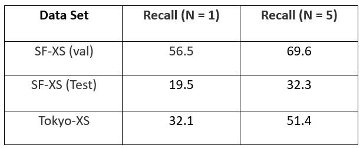

# Classification for Retrieval in Image Geolocalization with ASGD optimizer
Visual geo-localization (VG) estimates the location where a particular picture was taken, by comparing a given photo with a sizable database of pictures of locations that are known. This project is an extension to the previously designed training technique called CosPlace which aims at transforming the training into a classification problem, contrary to the previously used contrastive learning techniques. This project implements the model over the San Francisco extra small (XS) dataset as well as the tokyo (XS) dataset. Comparing the results of both, along with the visualization of predictions made by the model. Moreover, we proposed an extension for better performance i.e introducing ASGD optimizer instead of Adam.
## CosPlace Model :
The orignal code is available at this [GitHub repo](https://github.com/gmberton/CosPlace).
## The Datasets:
For training we used the following datasets:
- San Francisco eXtra Small (SF-XS): a subset of the SF-XL dataset. This is used
for training (SF-XS train), validation (SF-XS val) and testing (SF-XS test).

- Tokyo eXtra Small (Tokyo-XS): a subset of the Tokyo dataset. This is used
only for testing.
The datasets are available [at this link]([https://www.google.com](https://drive.google.com/drive/folders/1Ucy9JONT26EjDAjIJFhuL9qeLxgSZKmf))

## Experiments:
We obtained the following results from testing on the given datasets:

## Proposed extension. 
We used ASGD as an optimizer in place of Adam. We obtained the following results during the training phase:

